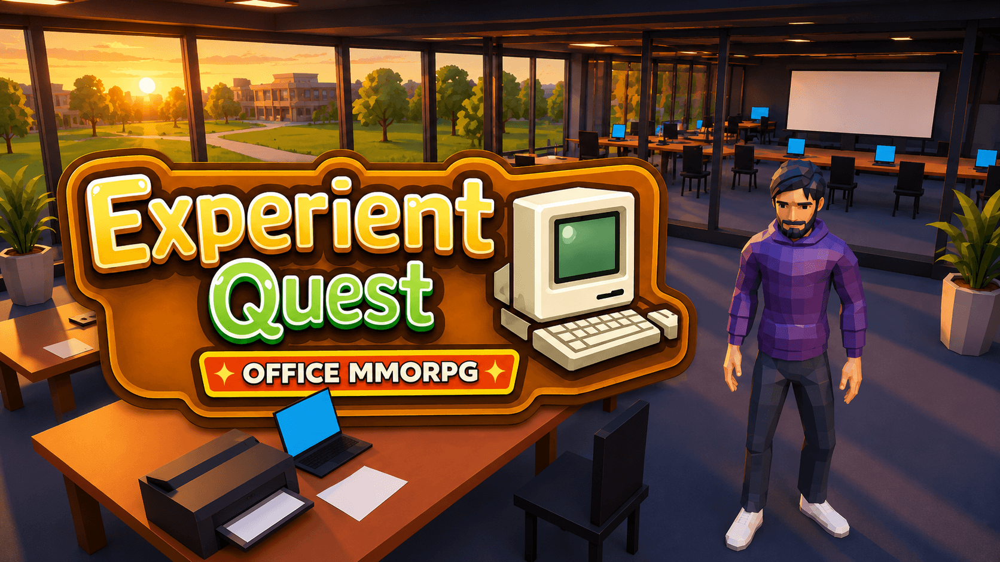

<p align="center">
  
</p>

# Experient Quest 🕹️

Wander the halls of Experient and help John pull off the weekly status
meeting. 🎤

Chat with your coworkers, poke around the office, and make sure the whole
thing goes off without a hitch. ✨

🛠️ Built with **React + TypeScript + Vite**, **@react-three/fiber**
(three.js) for the scene, **@react-three/rapier** for physics, and
**drei** for the glue that makes GLBs and animation blending pleasant to
work with.

## Get up and running 🚀

Two commands, no ceremony:

```bash
npm install
npm run dev
```

Then open the URL Vite prints and go take a walk around the office. 🚶

## Handy commands 📜

```bash
npm run dev             # start Vite dev server
npm run build           # type-check + production build
npm run preview         # preview the production build
npm run test            # vitest once
npm run test:watch      # vitest in watch mode
npm run test:e2e        # playwright smoke (dev server auto-started)
npm run test:e2e:install  # first-time: install Playwright browsers
npm run lint            # oxlint
npm run format          # prettier --write .
```

## Controls 🎮

```text
Move            WASD / Arrow keys
Run (toggle)    R                — running is ON by default
Roll            Space            — carries current velocity
Wave            C
Interact        F                — opens dialogue / overlay in range of a stop
Orbit camera    Q / E            — rotate view left / right
                Two-finger horizontal scroll (trackpad)
                Right- or middle-mouse drag (external mouse)
Zoom camera     + / -            — scales distance + height together
Close overlay   Escape / Close button / Backdrop click
Advance dialog  Space / Enter / click the panel
```

The camera is a third-person follow that orbits the player when you drag
with the right (or middle) mouse button. Movement is **camera-relative**:
W always sends the player away from the camera, so the same key feels
consistent as you rotate the view. 🎥 Movement is locked during roll / wave
and while an overlay or the quest-unlocked modal is open. Exterior doorways
are either sealed by invisible `DoorBlocker` colliders or open glass doors
(`<Door>` component); interior doorways stay open. 🚪

## Architecture at a glance 🏗️

React owns the app shell, prompt, and overlay. R3F owns the 3D scene, physics,
and camera. They communicate through a typed event bus
(`src/game/events/GameEventBus.ts`) so neither side imports the other's
components.

```
React (HTML)                             R3F (canvas)
─ App shell                              ─ OfficeScene
─ GameCanvas (hosts <Canvas>)            ─ ConferenceRoom / TheBakery /
─ InteractionPrompt                        CentralCorridor / EastCorridor /
─ ContentOverlay (TV / events)             CorridorPocket / TheLab / TheStation
─ DialogueOverlay (pixel-art NPC chat)   ─ Player (Rapier capsule + GLB + camera)
─ QuestUnlockedModal + QuestLog          ─ InteractionManager (XZ-plane zones)
        ▲                                        │
        └────────── typed event bus ─────────────┘
```

Events on the bus: `interaction:available` / `interaction:unavailable` /
`interaction:triggered` (R3F → React), `overlay:closed` (React → R3F). 📡

## Docs 📚

The `docs/` folder is the reference for detailed implementation, conventions,
and design notes:

| Task | Read first |
| --- | --- |
| Overall structure, new modules, refactors | [architecture.md](docs/architecture.md) |
| Player movement, camera, interactions, animations, NPCs | [gameplay-systems.md](docs/gameplay-systems.md) |
| Office layout, GLB imports, sprites, asset pipeline | [assets-and-content.md](docs/assets-and-content.md) |
| **Building or editing a room via ASCII grid** | [room-authoring.md](docs/room-authoring.md) |
| FPS, draw calls, mobile devices, quality profiles | [performance.md](docs/performance.md) |
| Unit + E2E testing, acceptance criteria | [testing.md](docs/testing.md) |
| Hosting, CDN, headers, CSP, releases | [deployment-and-security.md](docs/deployment-and-security.md) |
| Planning a feature, deciding what belongs in the MVP | [delivery-plan.md](docs/delivery-plan.md) |
| Accessibility: focus, keyboard, reduced motion, captions | [accessibility.md](docs/accessibility.md) |
| File naming, folder rules, import order, commit style | [conventions.md](docs/conventions.md) |

Working with an AI coding assistant? 🤖 Start from
[CLAUDE.md](CLAUDE.md) — it's the routing document that points at the right
doc per task.

## What's in the box today 🎁

- 🏢 **Layout**:
  - `ConferenceRoom` (20 × 14 m) with table, 10 chairs, wall TV, whiteboard.
  - `TheBakery` (south corridor) with desk clusters, kitchen counter + sink,
    and two NE alcove offices.
  - `CentralCorridor` — long N–S corridor west of the office; glass storefront
    east wall along every adjacent room's Z-span.
  - `CorridorPocket` + `EastCorridor` — L-shaped landing north of the
    conference room; hosts Distasi (interactable NPC) at a workbench.
  - `TheLab` — first branch room off the corridor. L-shaped, 3 east-side
    alcoves (2 furnished workstations), north/south work clusters,
    `TheLabCabinets` kitchen row.
  - `TheStation` — second branch room. L-shaped (NE corner clipped), 3
    north-side + 3 east-side alcoves, 2 west-wall workstations, and
    **The Boardroom** — enclosed sub-room with a wall-mounted TV and a
    4-seat meeting table.
- 🕺 **Player**: rigged GLB (`youngvz.glb`) with idle / walk / run / roll /
  wave animation blending, camera-relative movement.
- ⚙️ **Rapier physics**: dynamic capsule player, static geometry, sealed +
  open glass doors via reusable `<Door>` component.
- 🎥 **Third-person camera** with mouse-drag / trackpad orbit and keyboard
  zoom, clamped multiplicative scale.
- 👥 **NPCs**: reusable `<Employee>` static-NPC component; Distasi wired
  with a multi-line dialogue script.
- 💬 **Interactions**:
  - 📺 TV in the conference room (React modal overlay).
  - 🗨️ Distasi (retro pixel-art `<DialogueOverlay>` with portrait, first-
    encounter + repeat scripts).
- 📜 **Quest system**: `weekly-status-meeting` quest unlocks after the
  first Distasi chat, with a "New Quest Unlocked!" modal and a
  persistent top-right `QuestLog` HUD.
- ✅ **Tests**: Vitest unit test for `InteractionManager`, Playwright
  smoke test.

## What's next 🔮

- 🚪 Level transitions on doorway exit (swap `DoorBlocker` for a sensor collider).
- 👥 More NPCs (billboards + additional rigged presenters).
- 🎬 Camera modes: over-the-shoulder, first-person.
- 🎯 Additional interactables (new-hires, jokes, project rooms).
- 📋 Wire quest-task completion to specific stops (`toggleTask` already
  in the store).
- 🔊 Audio + captions, touch controls, localStorage save state.
